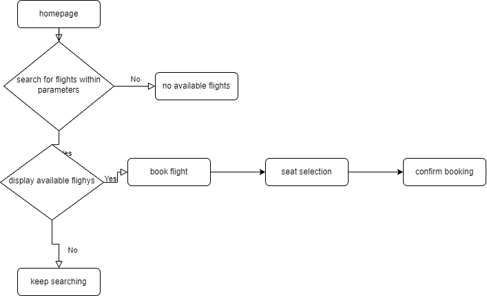
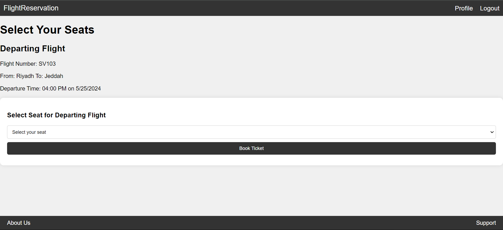
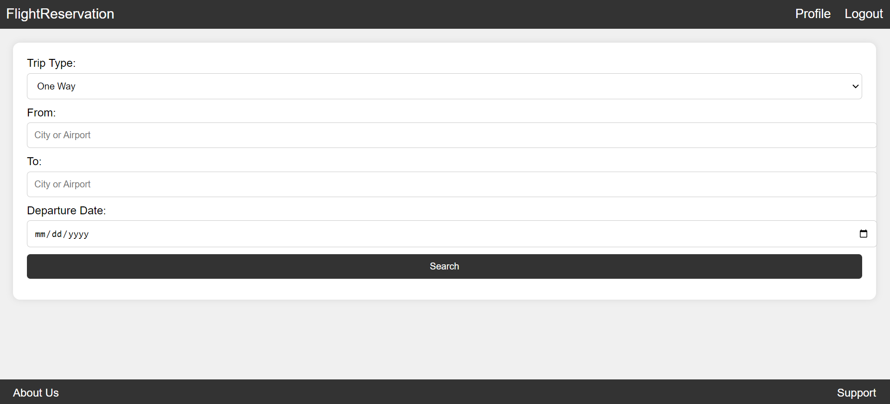
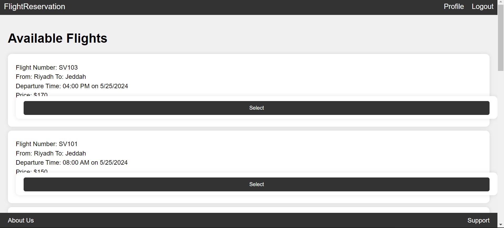

# Flight Booking System

## Overview
This project is a web application designed to facilitate the booking of flights between Riyadh and Jeddah. Users can search for flights, book tickets, and manage their bookings through a user-friendly interface. The main goal is to provide a seamless and efficient flight booking experience.

## Flow Chart


## Setup
To set up the project locally, follow these steps:

1. **Clone the repository:**
    ```sh
    git clone https://github.com/your-repo.git
    ```
2. **Navigate to the project directory:**
    ```sh
    cd your-repo
    ```
3. **Install dependencies:**
    ```sh
    npm install
    ```
4. **Start the development server:**
    ```sh
    npm start
    ```

## Technologies Used
- **Frontend:**
  - EJS for templating
  - Tailwind CSS for styling
- **Backend:**
  - Express.js
  - Node.js
  - MongoDB with Mongoose for the database
- **Authentication:**
  - bcrypt for hashing passwords
  - express-session for session management
- **Environment Variables:**
  - dotenv for environment configuration

## Goals
- Provide a user-friendly interface for booking flights between Riyadh and Jeddah.
- Store and manage user bookings efficiently.
- Ensure secure and reliable user authentication.

## Screenshots




## Future Work
- Implement additional features like flight cancellation and modification.
- Enhance the user interface for better user experience.
- Integrate additional payment options.

## Resources
- [Node.js Documentation](https://nodejs.org/en/docs/)
- [Express.js Documentation](https://expressjs.com/)
- [MongoDB Documentation](https://docs.mongodb.com/)
- [EJS Documentation](https://ejs.co/)
- [Tailwind CSS Documentation](https://tailwindcss.com/docs)

## Team Members
- **Name 1** - Role (e.g., Frontend Developer)
- **Name 2** - Role (e.g., Backend Developer)
- **Name 3** - Role (e.g., Database Administrator)
